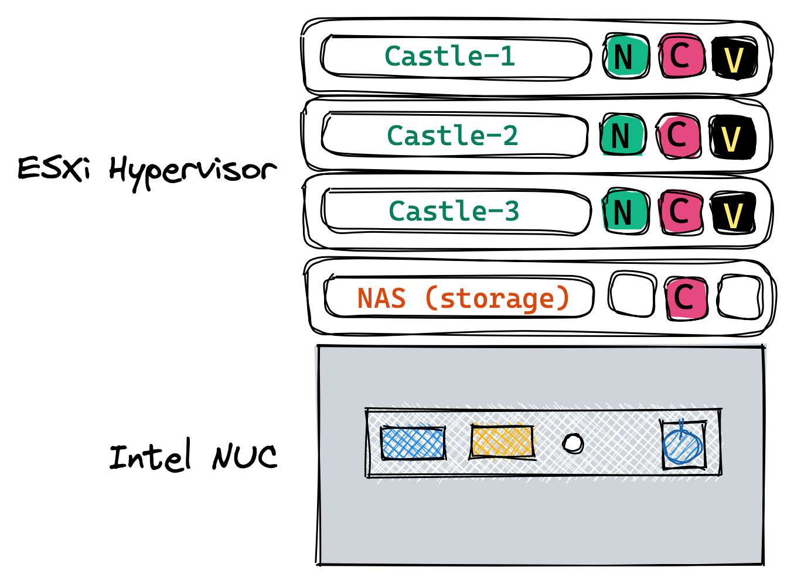

# Home Lab

If you want to skip ahead, please review [Repository Structure](#repository-structure) and [Preparatory Steps](#preparatory-steps).

## Background
This repository documents my home lab configuration. The original goal of this project was to provide a home server platform where I could run essential services in my home network 24/7/365, as well as provide space for learning and experimentation. I originally began with a [Raspberry Pi](https://www.raspberrypi.org) to run the DNS based ad blocker [Pi-hole](https://pi-hole.net) but I quickly outgrew that hardware. I settled on the [Intel NUC](https://www.intel.com/content/www/us/en/products/details/nuc.html) as the appropriate for my needs combination of performance/resources/power efficiency. The software is [VMware ESXi](https://www.vmware.com/products/esxi-and-esx.html) as a hypervisor, and [HashiCorp Nomad](https://www.nomadproject.io) as an orchestrator. 

## Design Goals
My design goals were to use infrastructure as code and immutable infrastructure to address challenges I've experienced in previous lab environments. What I found in my past experience is I would spend significant effort over days/weeks/months to get an environment set up and configured just right, but then lacking a complete record of the steps necessary to recreate it I would be terrified of messing it up or losing it. 

Often I would make some change to the environment and forget what I did or why I did it. Or I would upgrade a software package and later discover it messed something up. Without versioned infrastructure as code it was difficult to recover from an issue, especially if I didn't recall exactly what I had changed. If the problem was serious enough I would resort to rebuilding the system from scratch. Using versioned infrastructure makes it easier to recover from a failure, and easier to perform upgrades safely. 

## Architecture
The high level architecture is VMs on ESXi running on an [Intel NUC](https://www.intel.com/content/www/us/en/products/details/nuc.html).

- Castle nodes are Nomad/Consul/Vault servers
- NAS provides an NFS volume for persistent storage



### Hypervisor
I selected ESXi as the hypervisor due to its widespread popularity and compatibility. I originally began with ESXi 6.7 but am now on 7.0 Update 1.

- [VMware Compatibility Guide](https://www.vmware.com/resources/compatibility/search.php?deviceCategory=software&details=1&operatingSystems=272&page=1&display_interval=20&sortColumn=Partner&sortOrder=Asc&testConfig=16)
- [How to obtain an ESXi 7.0 free license](https://www.virten.net/2020/04/free-esxi-7-0-how-to-download-and-get-license-keys/) 

### Software
Each of the three Castle nodes run Nomad, Consul, and Vault, to form highly available clusters of each application.

[Nomad](https://nomadproject.io) serves as a general purpose orchestrator that can handle containers, VMs, Java, scripts, and more. I selected Nomad for its simplicity and ease of use. Nomad supports a server/client mode for development where machines can function as both a server and a client, and this is what I use. Each Castle node operates as a Nomad server and a Nomad client.

[Consul](https://consul.io) serves as the service catalog. It integrates natively with Nomad to register and deregister services as they are deployed or terminated, provide health checks, and enable secure service-to-service communication. Each Castle node operates as a Consul server, however the server can also act as a client agent.

[Vault](https://vaultproject.io) provides secrets management. It integrates natively with Nomad to provide secrets to application workloads. Although Vault 1.4+ can perform its own data storage, I found it simpler in this environment to use Consul as the storage backend for Vault since the nodes will automatically discover each other through the Consul storage backend. Each Castle node operates as a Vault server.

### Persistent Storage
Some of the applications that will be run in this environment require persistent storage. The datastore needs to be consistent and available to services that are scheduled on any of the Castle nodes. The approach I chose was to leverage Florian Apolloner's [NFS CSI Plugin](https://gitlab.com/rocketduck/csi-plugin-nfs) which should work with any NFS share. Since I did not have one I opted to create a storage VM that functions as a virtual Network-attached storage (NAS) device. The VM has a ZFS volume that is optionally mirrored across two physical volumes on the ESXi host. This provides some degree of redundancy in the event of a single disk failure. Additionally, the persistent data could be backed up to a cloud storage solution such as Backblaze or S3 or wherever. The ZFS volume is exposed as an NFS share, and then storage volumes can be created with Nomad via the CSI plugin.

### Backups
There are Consul and Nomad snapshot agents running that periodically save Consul and Nomad cluster snapshots. Additionally with Vault Enterprise, one could establish a Disaster Recovery cluster on another machine that would contain a complete copy of the Vault cluster data and configuration.

### DNS
One of the original requirements for this project was to provide a primary LDNS for my home network. That is accomplished with [Pi-hole](https://pi-hole.net) running on Nomad. In the Pi-hole job, [Keepalived](https://www.keepalived.org) is used to provide a floating VIP (virtual address). My secondary LDNS is my home router. I've configured it per the [Forward DNS for Consul Service Discovery](https://learn.hashicorp.com/tutorials/consul/dns-forwarding) tutorial so it can resolve queries for .consul as well. 

#### Security/Privacy
DNS over HTTPS to Cloudflare is used in the [Pi-hole configuration](./nomad-jobs/pi-hole.nomad).

#### Futures
- Watching [#7430](https://github.com/traefik/traefik/issues/7430) for Traefik UDP fix

### IPAM
In a cloud environment we would have capabilities like cloud auto join to enable the nodes to discover each other and form a cluster. Since we don't exactly have this capability available in the home lab I resort to static IP addresses. Each node has a designated IP address so they will be able to communicate with each other and form a cluster. This is mainly applicable to Consul, because absent static addresses the Nomad and Vault servers could locate each other with Consul. However the Consul servers would already have to be in place and the simplest way to do that in this lab is with static addresses.

### Upgrades
In a cloud environment we would have primitives like auto scaling groups that faciliate dynamic infrastructure and make immutable upgrades effortless. Since we don't exactly have this capability available in the home lab I use a blue green approach for upgrades. We designate three blue nodes and three green nodes. We begin by provisioning the "blue" nodes. When it comes time for an upgrade, we update our base images and provision the "green" nodes. Once we've verified the green nodes are healthy, we drain the blue nodes and destroy them, leaving just the new green nodes. If something goes wrong or there is a problem with the upgrade we still have our original blue nodes. We can remove the green nodes and try again. Repeat.

### Telemetry and Monitoring


These guides serve as a great starting point and are what I have followed:
- [Monitor Telemetry & Audit Device Log Data](https://learn.hashicorp.com/tutorials/vault/monitor-telemetry-audit-splunk)
- [Vault Cluster Monitoring](https://learn.hashicorp.com/tutorials/vault/monitoring) (specifically the [PDF](https://hashicorp-education.s3-us-west-2.amazonaws.com/whitepapers/Vault/Vault-Consul-Monitoring-Guide.pdf))
- [Monitor Consul Datacenter Health with Telegraf](https://learn.hashicorp.com/tutorials/consul/monitor-health-telegraf?in=consul/day-2-operations)

There are additional details in the [nomad-jobs README](./nomad-jobs/README.md#grafana).

### Certificates
If you would like to avoid repeated certificate warnings in your browser and elsewhere, you can build your own certificate authority and add the root certificate to the trust store on your machines. Once you’ve done that Vault can issue trusted certificates for other hosts or applications, like your ESXi host for example. Later when configuring Traefik you can provide it with a wildcard certificate from Vault or configure the Traefik's Let’s Encrypt provider to obtain a publicly trusted certificate.

*Note*: If you do not add your root certificate to the system trust store you’ll need to add VAULT_SKIP_VERIFY to the Nomad server

### Ingress
The idea with Traefik is now easy ingress - automatic TLS, plus connect sidecar means automatic TLS for everything with a couple lines of config in the Nomad job.

### Secrets / Trusted Orchestrator
In a cloud environment we would have machine identity provided by the platform that we could directly leverage for authentication and access to secrets. Since we don't have that capability in this "on prem" lab, we can use Vault's [AppRole](https://www.vaultproject.io/docs/auth/approle) authentication method in a [Trusted orchestrator](https://learn.hashicorp.com/tutorials/vault/secure-introduction#trusted-orchestrator) model to faciliate the secure introduction of secrets to our server nodes.

## Hardware
I looked for low power consumption systems with a large number of logical cores. I selected the 2018 [Intel NUC8i7BEH](https://www.intel.com/content/www/us/en/products/sku/126140/intel-nuc-kit-nuc8i7beh/specifications.html), which provides 8 logical cores and pretty good performance relative to its cost and power consumption. It supports up to 64 GB RAM and provides two internal drive bays, as well as support for external storage via a Thunderbolt 3 interface. The basic elements of the lab do not require all that much storage; 500 GB would be sufficient. However I would recommend at least 1 TB over two physical volumes to provide adequate room for troubleshooting, recovery, experimentation, and growth. 

Here's a terrific blog post that provides an overview comparison of the various Intel NUC models:
- [Which Intel NUC should I buy for VMware ESXi? (August 2020)](https://www.virten.net/2020/08/which-intel-nuc-should-i-buy-for-vmware-esxi-august-2020/)

## Repository Structure
This repo is composed of two parts:
- ESXi Home Lab infrastructure
- Nomad Jobs

The high level steps are:

0. Install and configure ESXi.
1. Use the [Packer template](./esxi/packer) to create a base image on your ESXi host. See [Packer README](./esxi/packer/README.md) for specific steps.
2. Use the [Terraform code](./esxi/terraform) to provision server VMs on your ESXi host using the base image as a template. See [Terraform README](./esxi/terraform/README.md) for specific steps.
3. Use the [Nomad job files](./nomad-jobs) to run services on cluster. See [README](./nomad-jobs/README.md) for specifics.

### Preparation Steps
I recommend starting a Vault instance before continuing on with these steps. It will be easier to use these configs as they expect the secrets to be in Vault. Once you have a provisional Vault server running, you can build your CA, create an AppRole, and store passwords needed by the Packer templates. Later, when your real cluster is ready you can migrate the provisional Vault data to the real one. 

In my environment at that stage I configured the real cluster as a DR secondary, allowing Vault to replicate all secrets and configuration to it, and then designated it the primary. I then configured the original provisional cluster as a DR secondary. Alternatively you could migrate using `vault operator migrate`, referencing the [Storage Migration tutorial](https://learn.hashicorp.com/tutorials/vault/raft-migration) Learn guide but going in the opposite direction.

There is a simple Vagrantfile that you can use to spin up a single node Vault server [here](./vagrant/Vagrantfile).

#### I. Trusted orchestrator setup
1. Create the trusted orchestrator policy. This will be used by Terraform to issue wrapped SecretIDs to the nodes during the provisioning process.
```
vault policy write trusted-orchestrator -<<EOF
# the ability to generate wrapped secretIDs for the nomad server bootstrap approle
path "auth/approle/role/bootstrap/secret*" {
  capabilities = [ "create", "read", "update" ]
  min_wrapping_ttl = "100s"
  max_wrapping_ttl = "600s"
}

# required for vault terraform provider to function
path "auth/token/create" {
  capabilities = ["create", "update"]
}

# required to create
path "auth/token/lookup-accessor" {
  capabilities = ["update"]
}

# required to destroy
path "auth/token/revoke-accessor" {
  capabilities = ["update"]
}
EOF
```

2. Issue a Vault token for your Terraform workspace and set it as the `VAULT_TOKEN` environment variable in your Terraform workspace. In Terraform Cloud this variable should be marked as Sensitive.
```
vault token create -orphan \
  -display-name=trusted-orchestrator-terraform \
  -policy=trusted-orchestrator \
  -explicit-max-ttl=4320h \
  -ttl=4320h
```

3. Create a nomad server policy and Vault token role configuration as outlined in the [Nomad Vault Configuration Documentation](https://www.nomadproject.io/docs/integrations/vault-integration#token-role-based-integration).

4. Create an AppRole called `bootstrap` to be used in the build process by following the [AppRole Pull Authentication](https://learn.hashicorp.com/tutorials/vault/approle) Learn guide. The bootstrap role, should have the nomad-server policy assigned, as well as a policy similar to the below for authorization to retrieve a certificate (substitute your path names, and add your particular cloud credential if using a cloud auto unseal):
```
vault policy write pki -<<EOF
path "pki/intermediate/issue/hashidemos-io" {
  capabilities = [ "update" ]
}

path "auth/token/create" {
  capabilities = ["create", "read", "update", "list"]
}
EOF
```

Here is how to create the bootstrap role:
```
vault write auth/approle/role/bootstrap \
  secret_id_bound_cidrs="192.168.0.101/32","192.168.0.102/31","192.168.0.104/31","192.168.0.106/32" \
  secret_id_num_uses=1 \
  secret_id_ttl=420s \
  token_bound_cidrs="192.168.0.101/32","192.168.0.102/31","192.168.0.104/31","192.168.0.106/32" \
  token_period=259200 \
  token_policies="pki,gcp-kms,nomad-server"
```
Please check the [docs](https://www.vaultproject.io/api/auth/approle#create-update-approle) to understand what the above parameters do.

5. Save the RoleID in a file called `role_id` and place it in the [castle files](./esxi/packer/castle/files) directory. 

The SecretID is generated and delivered by Terraform as defined in [main.tf](./esxi/terraform/main.tf), and after booting the RoleID and wrapped SecretID are used by Vault Agent to authenticate to Vault and retrieve a token, using this [Vault Agent config](./esxi/packer/castle/files/vault-agent-bootstrap.hcl).

Docs:
- https://learn.hashicorp.com/tutorials/vault/pattern-approle?in=vault/recommended-patterns
- https://www.nomadproject.io/docs/integrations/vault-integration

#### II. Certificate authority setup
1. Follow the [Build Your Own Certificate Authority](https://learn.hashicorp.com/tutorials/vault/pki-engine) guide to generate your root and intermediate CAs.
2. Save the root certificate as `root.crt` in the [castle files](./esxi/packer/castle/files) directory.
3. Update the `cert.tpl` and `key.tpl` Vault Agent templates in the [castle files](./esxi/packer/castle/files) directory with your host/domain/role names. These templates are for the provisioner script that runs in Terraform. It runs Vault Agent once to authenticate to Vault and issue certificates for the Vault servers to use.

#### III. Customizations
1. Configure your desired [seal stanza](https://www.vaultproject.io/docs/configuration/seal) in the [Vault configuration](./esxi/packer/castle/files/vault.hcl) file. This stanza is optional, and in the case of the master key, Vault will use the Shamir algorithm to cryptographically split the master key if this is not configured. I happen to use GCP KMS, which require GCP credentials be placed on each Vault server. There are a variety of ways to accomplish this. I have them retrieved from Vault and rendered onto the file system by Vault Agent in [setup_castle.tpl](./esxi/terraform/setup_castle.tpl), which is run as a provisioner (i know :-D) in the Terraform code.
2. Search and replace all IP addresses to match your private network address range.
3. If you do not have enterprise licenses search and replace all packages to oss.

#### Futures
- When looking to improve this overall architecture I will be looking at adding some automated pipelines.

## Enterprise Features in use
Nomad
- [Automated Backups](https://www.nomadproject.io/docs/enterprise#automated-backups)
- [Automated Upgrades](https://www.nomadproject.io/docs/enterprise#automated-upgrades)
- [Dynamic Application Sizing](https://www.nomadproject.io/docs/enterprise#dynamic-application-sizing)

Consul
- [Automated Backups](https://www.consul.io/docs/enterprise/backups)
- [Automated Upgrades](https://www.consul.io/docs/enterprise/upgrades)

Terraform Cloud
- [Terraform Cloud Agent](https://www.terraform.io/docs/cloud/agents/index.html)

## Links and References
Going to need these at one point or another:
- [Consul Outage Recovery](https://learn.hashicorp.com/tutorials/consul/recovery-outage)
- [Nomad Outage Recovery](https://learn.hashicorp.com/tutorials/nomad/outage-recovery)
