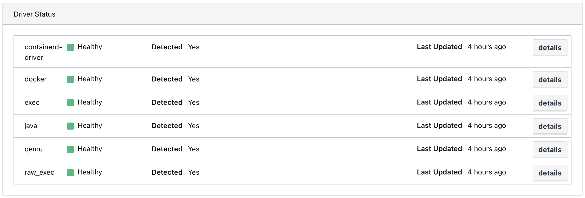

# Packer templates for Home Lab 2.0 on ESXi

## Images
All images are based on ubuntu-18.04.5, using the `vmware-iso` builder.

### NAS (Virtual Network Attached Storage machine)
This template will provide the NFS share. The configuration for it will be performed with Terraform.

### Castle (Nomad/Consul/Vault cluster servers)
This template provides the Nomad + Consul + Vault servers. I generally based this upon these deployment guides:
* [Nomad Deployment Guide](https://learn.hashicorp.com/tutorials/nomad/production-deployment-guide-vm-with-consul)
* [Consul Deployment Guide](https://learn.hashicorp.com/tutorials/consul/deployment-guide)
* [Vault Deployment Guide](https://learn.hashicorp.com/tutorials/vault/deployment-guide)

The following Nomad task drivers will be installed/enabled:

## Steps
*Note*: These templates require SSH access to the ESXi host. I recommend creating a role and user account on the ESXi host for Packer and Terraform.

### Secrets from Vault
If you are building this for the first time and don't have a Vault server yet, you have at least two options. You can either start up a local Vault server ([dev](https://learn.hashicorp.com/tutorials/vault/getting-started-dev-server) or [not](https://learn.hashicorp.com/tutorials/vault/getting-started-deploy)) and store the secrets there until you have a stateful Vault up and running, or you can provide the Packer variables [as environment variables](https://www.packer.io/docs/templates/legacy_json_templates/user-variables#environment-variables). As outlined in the [Preparation Steps](../../README.md#preparation-steps) I recommend spinning up a provisional Vault instance, and a sample Vagrantfile is provided [here](../../vagrant/Vagrantfile).

### Variables
Review the template and preseed *carefully*. You will need to change and customize for your environment. For example the `network_name` will need to match the network name configured on your ESXi host. The default is usually "VM Network". The `remote_datastore` will need to match the name of the datastore on your ESXi host that you'd like to use. You may also wish to configure the CPU, memory, and disk size. Some other variables configured in the templates that you will need to specify:
- `authorized_keys`: These are SSH public keys that you want to allow SSH permission.
- `esxi_host`: The address of your ESXi host.
- `esxi_password`: Password for account on your ESXi host that Packer will use to deploy the template.
- `esxi_username`: Username for account on your ESXi host that Packer will use to deploy the template.
- `ssh_password`: This is the linux account password for the ubuntu user on this machine. 

I store most of these values in Vault and Packer will retrieve them from the paths defined in the variables file of the templates. Ensure `VAULT_ADDR` and `VAULT_TOKEN` environment variables are loaded in your shell before running Packer.

### Linux User Password
In the preseed files, you can provide a default user password based on the [password steps](#password-steps) listed below. I also disable Ubuntu's default systemd DNS resolver because I find it has sometimes unpredictable behavior. Instead I am hard-coding in my local DNS servers near the bottom of the file so you may need to change the IP addresses specified there.

### Enterprise Licenses
By default the Castle template will install enterprise versions of Consul, Vault, and Nomad, so licenses will be required. If you do not have or wish to use enterprise licenses, please search and replace all packages with the oss versions. (Replace `consul_enterprise` with `consul`, `nomad_enterprise` with `nomad`, `vault_enterprise` with `vault`, remove all instances of `+ent` from the Packer templates, remove the licenses from the Packer templates, and remove the `license_path` lines from the Consul, Nomad, and Vault config files.)

### Consul Gossip Encryption
If you'd like to use Consul gossip encryption, please follow the steps in the [Secure Gossip Communication with Encryption](https://learn.hashicorp.com/tutorials/consul/gossip-encryption-secure) guide and provide your key as the `consul_gossip` local variable. If you are not using gossip encryption you'll need to remove the line `encrypt = ""` from each Consul configuration file.

### Nomad Gossip Encryption
If you'd like to use Nomad gossip encryption, please follow the steps in the [Enable Gossip Encryption for Nomad](https://learn.hashicorp.com/tutorials/nomad/security-gossip-encryption) guide and provide your key as the `nomad_gossip` local variable. If you are not using gossip encryption you'll need to remove the line `encrypt = ""` from each Nomad configuration file.

### Vault Agent Bootstrap
Please double check the Vault server address specified in [vault-agent-bootstrap.hcl](./castle/files/vault-agent-bootstrap.hcl). This is invoked during provisioning with Terraform to pull down secrets from Vault. If you are building this for the first time and don't have a Vault server yet, check the [Steps](#steps) section below for options or omit this step and provide the secrets some other way. 

### ovftool
Please go [download VMware ovftool](https://code.vmware.com/web/tool/4.4.0/ovf), which is required for the ESXi terraform provider, and place the `VMware-ovftool-4.4.1-16812187-lin.x86_64.bundle` in the [castle/files](./castle/files) directory. I clicked the Download link next to 4.4.1, accepted the EULA, and selected the x86_64 download.

### Consul and Nomad Autopilot
When rolling out a new template, make sure to increment the:
- node_meta tag `build` in the [Consul config](./castle/files/consul.hcl) so [Consul Autopilot](https://learn.hashicorp.com/tutorials/consul/upgrade-automation) can do its thing.
- `upgrade_version` in the [Nomad config](./castle/files/nomad.hcl) so [Nomad Autopilot](https://learn.hashicorp.com/tutorials/nomad/autopilot) can do its thing.

### How to build
Execute `packer build -on-error=ask .` from within each folder to create the respective template. It may take about 10-15 minutes to complete.

### Password Steps
These are steps for how to set a linux user password in the preseed file:
1. generate and save a random password in 1password. this will be the linux user password for the default ubuntu user account.
2. save this password in vault for packer to retrieve when running the template.
3. use `mkpasswd -m sha-512` to generate the password hash that goes in the preseed.

## Extras
You can use `shared_packer_cache.sh` to create symbolic links to share the packer cache in each folder, saving on ISO downloads.