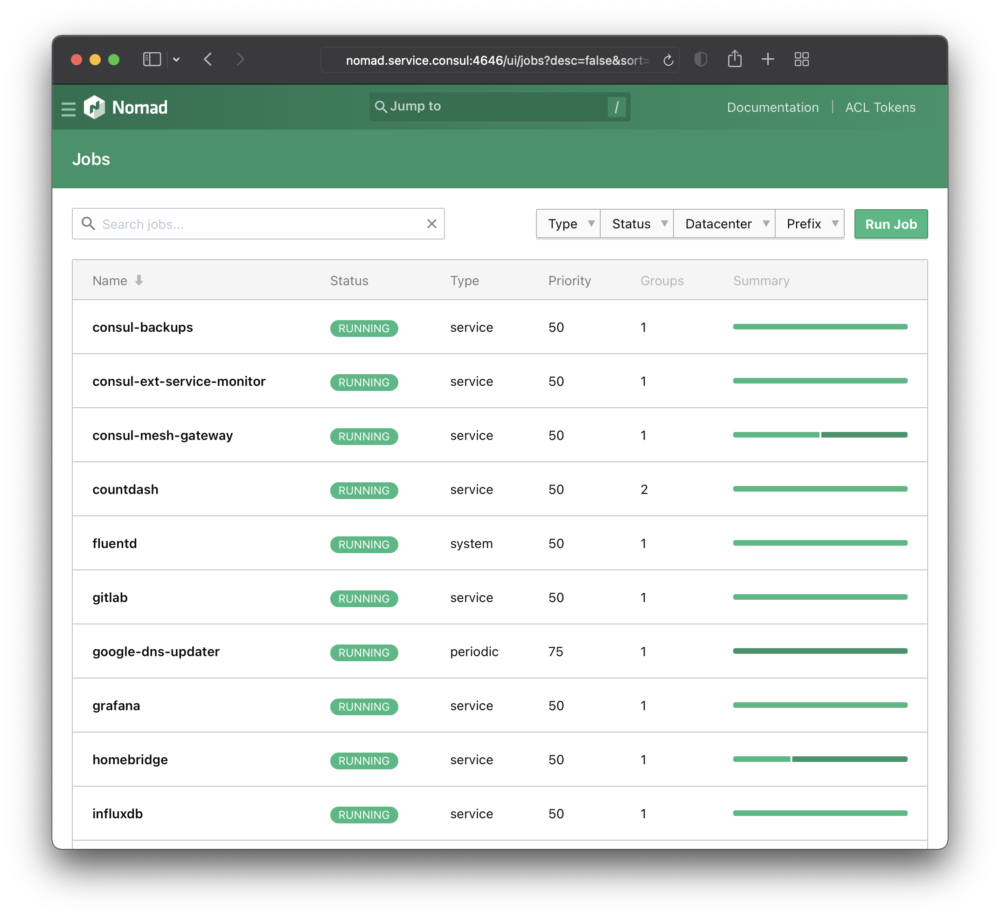

# Nomad Jobs for Home Lab

A set of Nomad job files for services and applications I run in my home lab. These may require modification to work in your environment.

Storage is provided via Florian Apolloner's [NFS CSI Plugin](https://gitlab.com/rocketduck/csi-plugin-nfs) which should work with any NFS share. Please review his documentation for details on how to configure and use it.

## Notes
There is Terraform code here if you'd like to manage these with Terraform and the Nomad provider, however this is not required. Please exercise caution as deleting an external volume will destroy the data on that volume.

To use the QEMU driver, you'll have to expose HW assisted virtualization on the Nomad client VMs in ESXi.

### Best practices
- Explicitly specify the tag version for more controlled updates/upgrades.

### Consul External Service Monitor
There is an example service registration in the [consul-esm](./consul-esm) folder. Learn more in the [Register External Services with Consul Service Discovery](https://learn.hashicorp.com/tutorials/consul/service-registration-external-services) Learn guide. 

### GitLab
- [Configuring external URL](https://gitlab.com/gitlab-org/omnibus-gitlab/-/blob/master/doc/settings/configuration.md#configuring-the-external-url-for-gitlab)
- Looks like i need to update the readiness probes to IP whitelist per https://docs.gitlab.com/ee/user/admin_area/monitoring/health_check.html#access-token-deprecated

### Grafana
There are dashboards for the following in the [grafana-dashboards](./grafana-dashboards) folder:
- [Consul Cluster Health](https://github.com/tradel/vault-consul-monitoring/blob/master/dashboards/consul_cluster_health.json)
- [Vault Cluster Health](https://github.com/tradel/vault-consul-monitoring/blob/master/dashboards/vault_cluster_health.json)
- [Nomad Cluster](https://github.com/bitrockteam/caravan-application-support/blob/release/caravan-0.1/grafana_dashboards/nomad-cluster_rev1.json)
- [Nomad Jobs](https://github.com/bitrockteam/caravan-application-support/blob/release/caravan-0.1/grafana_dashboards/nomad-jobs_rev1.json)
- [Node Exporter](https://github.com/bitrockteam/caravan-application-support/blob/release/caravan-0.1/grafana_dashboards/node-exporter_rev1.json)
- [ESXi Host](https://grafana.com/grafana/dashboards/10076)
- [Pi-hole](https://grafana.com/grafana/dashboards/10176)
- [Internet connection](https://github.com/geerlingguy/internet-pi/blob/master/internet-monitoring/grafana/provisioning/dashboards/internet-connection.json)
- [Speedtest](https://github.com/MiguelNdeCarvalho/speedtest-exporter/blob/main/Dashboard/Speedtest%20Dashboard-1609529464845.json)
- [Blackbox Exporter](https://grafana.com/grafana/dashboards/7587)
- [Prometheus 2.0 Stats](https://github.com/grafana/grafana/blob/main/public/app/plugins/datasource/prometheus/dashboards/prometheus_2_stats.json)
- [Ubiquiti EdgeRouter](https://github.com/WaterByWind/grafana-dashboards/tree/master/UBNT-EdgeRouter)

These must be manually imported from within Grafana. Some of the dashboards require Grafana plugins.

### hclfmt-all
Script to invoke linter on all nomad files in the folder. Requires the deprecated [hclfmt](https://github.com/fatih/hclfmt) be installed and available in your path.

### NFS CSI Plugin
Watching [#10927](https://github.com/hashicorp/nomad/issues/10927) as I sometimes encounter this issue. The workaround is to deregister and reregister the volume. (Deregistering the volume will not destroy the data on the NFS volume.)

### Pi-hole
I am using Pi-hole as my primary LDNS. I have a filter configured in a Nomad template stanza that will check all services in Consul for the presence of a tag `dnsmasq.cname=true`. For each service with that tag, a DNS entry for that service will be created on Pi-hole. This allows me to easily make a service available automatically. 

I am using [cloudflared](https://developers.cloudflare.com/cloudflare-one/connections/connect-apps/install-and-setup/installation) as the resolver, this is not required and can be removed.

[Keepalived](https://www.keepalived.org) is used to provide a floating VIP (virtual address). This is useful if you would like to use Pi-hole as a local DNS server.

### Splunk
https://docs.splunk.com/Documentation/Splunk/8.2.1/Admin/MoreaboutSplunkFree

### tfc-agent
I run this as an Exec instead of Docker to make sure local networking works as expected when using the esxi provider to a local ESXi host.

### Traefik
I am using the [Let's Encrypt integration](https://doc.traefik.io/traefik/https/acme/) to automatically obtain and renew a publicly signed wildcard certificate. This is not required. You'll need to search and replace all tags with your domain name.

[Keepalived](https://www.keepalived.org) is used to provide a floating VIP (virtual address). This is useful if you would like to expose a port on your router and forward traffic to the Traefik ingress.

#### Issues
- Watching [#7430](https://github.com/traefik/traefik/issues/7430) for a UDP fix

## Links and References
- https://github.com/GuyBarros/nomad_jobs
- https://github.com/angrycub/nomad_example_jobs/
- https://github.com/scarolan/migrate-vmware-to-nomad/
- https://github.com/jescholl/nomad